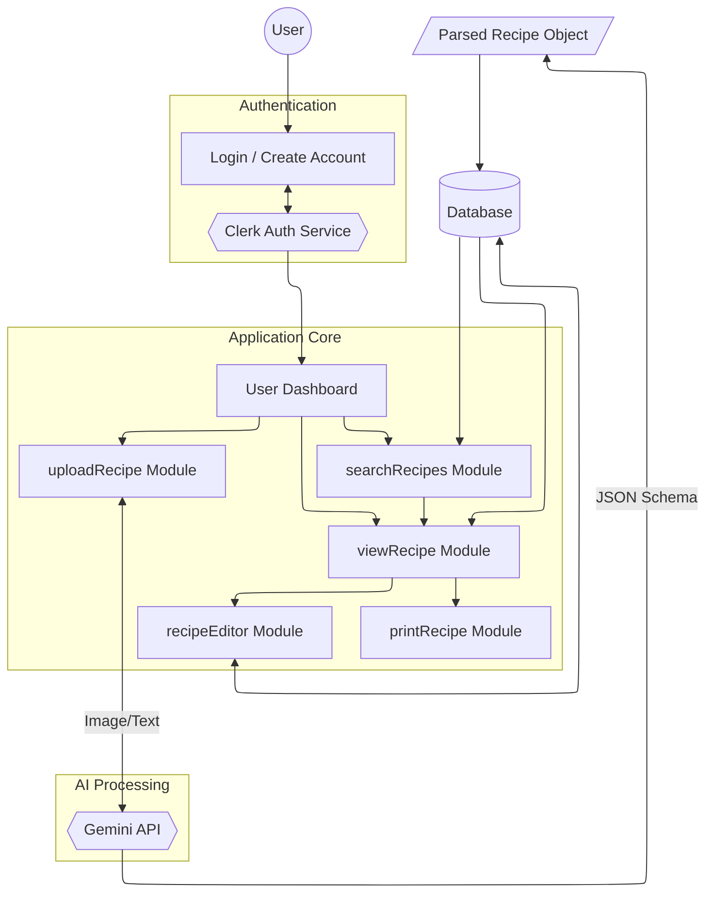

```mermaid
---
config:
  layout: elk
---
graph TD
    User((User))

    subgraph Auth_Layer [Authentication]
        Login[Login / Create Account]
        Clerk{{Clerk Auth Service}}
    end

    subgraph App_Logic [Application Core]
        Dashboard[User Dashboard]
        Upload[uploadRecipe Module]
        Viewer[viewRecipe Module]
        Editor[recipeEditor Module]
        Search[searchRecipes Module]
        Printer[printRecipe Module]
    end

    subgraph External_AI [AI Processing]
        Gemini{{Gemini API}}
    end
    User --> Login
    Login <--> Clerk
    Clerk --> Dashboard
    Dashboard --> Upload
    Upload <--> |Image/Text| Gemini
    Gemini --> |JSON Schema| Parsed[/Parsed Recipe Object/]
    Parsed --> DB
    Dashboard --> Search
    Dashboard --> Viewer

    Search --> Viewer
    Viewer --> Editor
    Viewer --> Printer
    DB[(Database)]
    Editor <--> DB
    DB --> Viewer
    DB --> Search
```
